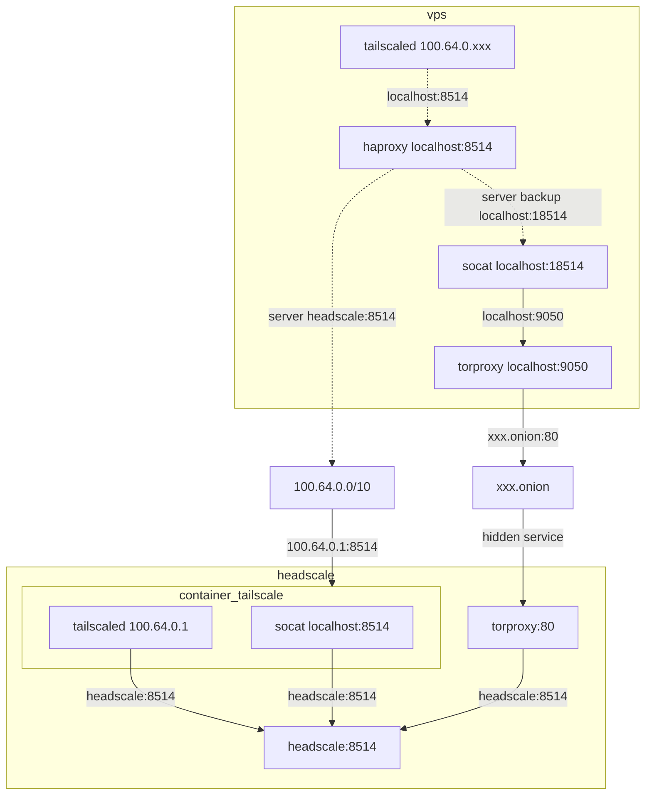

# Headscale

```mermaid
flowchart TB
    subgraph vps
        vps_tailscale[tailscaled 100.64.0.xxx]

        vps_haproxy[haproxy localhost:8514]
        vps_socat[socat localhost:18514]
        vps_tor[torproxy localhost:9050]
    end

    network_tor_hiddenservice[xxx.onion]
    network_tailscale[100.64.0.0/10]

    subgraph headscale
        container_headscale[headscale:8514]
        container_tor[torproxy:80]
        subgraph container_tailscale
            container_tailscale_socat[socat localhost:8514]
            container_tailscale_tailscale[tailscaled 100.64.0.1]
        end
        container_tailscale_tailscale -- headscale:8514 --> container_headscale
    end

    vps_tailscale -. localhost:8514 .-> vps_haproxy
    vps_haproxy -. server headscale:8514 .-> network_tailscale
    vps_haproxy -. server backup localhost:18514 .-> vps_socat
    vps_socat -- localhost:9050 --> vps_tor
    vps_tor -- xxx.onion:80 --> network_tor_hiddenservice

    container_tailscale_socat -- headscale:8514 --> container_headscale
    container_tor -- headscale:8514 --> container_headscale

    network_tailscale -- 100.64.0.1:8514 --> container_tailscale
    network_tor_hiddenservice -- hidden service --> container_tor
```
